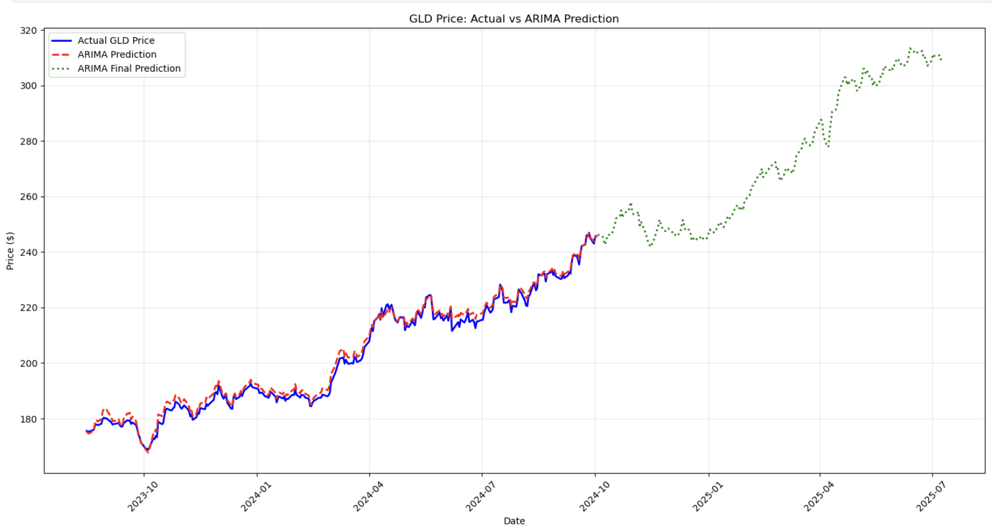
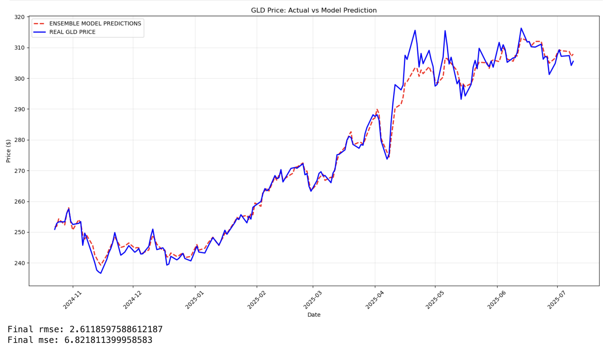
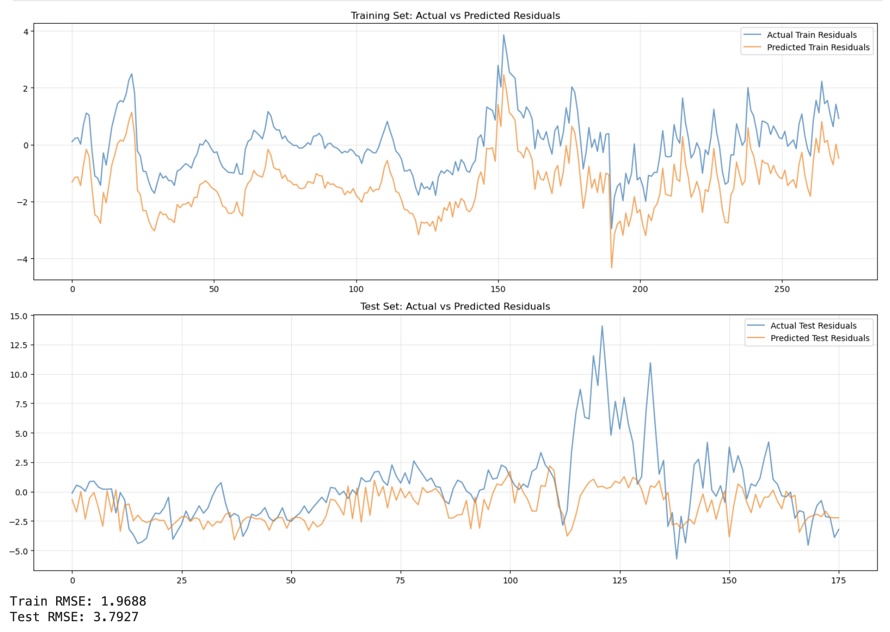

# GLD-Trader

An algorithmic trading model for GLD ETF using hybrid ARIMA-LSTM architecture with multi-source data integration (macro data, stock prices, and news data with FinBERT sentiment analysis)

## Model Architecture

The project implements an ensemble approach combining ARIMA and LSTM models:

1. **ARIMA Model**: Captures linear trends and seasonality using technical indicators and macroeconomic features
2. **LSTM Model**: Models non-linear patterns in ARIMA residuals for improved prediction accuracy
3. **Ensemble Prediction**: Final predictions combine ARIMA forecasts with LSTM-predicted residual corrections

## Data Sources

### Market Data
- **GLD ETF**: Daily OHLCV data with technical indicators
- **Technical Indicators**: EMA (30, 60, 200), RSI (14), MACD, Bollinger Bands, Momentum (10)

### Macroeconomic Data
- **DTWEXBGS**: US Dollar Trade Weighted Exchange Rate
- **CPIAUCSL**: Consumer Price Index (inflation)
- **FEDFUNDS**: Federal Funds Rate
- **GDP**: Gross Domestic Product
- **OIL_PRICE**: Crude Oil Prices

### Sentiment Analysis
- **FinBERT**: Financial news sentiment analysis using pre-trained FinBERT model
- **News Sources**: Daily financial news related to gold and market conditions

## Model Performance







## Project Structure

```
GLD-Trader/
├── data/
│   ├── ingestion/           # Data collection scripts
│   ├── combined_data.csv    # Final processed dataset
│   ├── finbert_gold_news.csv # Sentiment-analyzed news
│   └── macro_data.csv       # Macroeconomic indicators
├── models/
│   └── training.ipynb       # Model development and training
├── images/                  # Performance visualizations
└── logs/                    # Data ingestion logs
```

## Data Features

The model uses 20+ features including:
- Technical indicators (EMAs, RSI, MACD, Bollinger Bands)
- Macroeconomic indicators (interest rates, inflation, USD strength, oil prices)
- Market volume and momentum
- News sentiment scores (FinBERT-based)

## Implementation Details

### ARIMA Component
- Order: (1, 1, 0) with exogenous variables
- Uses all technical and macroeconomic features
- Captures linear market trends and fundamental relationships

### LSTM Component
- 16 hidden units with 0.5 dropout
- 14-day sliding window for residual prediction
- SGD optimizer with momentum and learning rate scheduling
- Trained for 1000 epochs with early stopping

### Training Strategy
- 60% ARIMA training, 24% LSTM training, 16% final testing
- StandardScaler normalization for LSTM features
- Residual-based ensemble approach for improved accuracy

## Usage

1. Run data ingestion scripts in `data/ingestion/`
2. Execute model training in `models/training.ipynb`
3. View performance metrics and visualizations
4. Apply trained model for GLD price predictions

## Dependencies

See `requirements.txt` for complete package list including:
- pandas, numpy, scikit-learn
- statsmodels (ARIMA)
- torch (LSTM)
- transformers (FinBERT)
- matplotlib, seaborn (visualization)